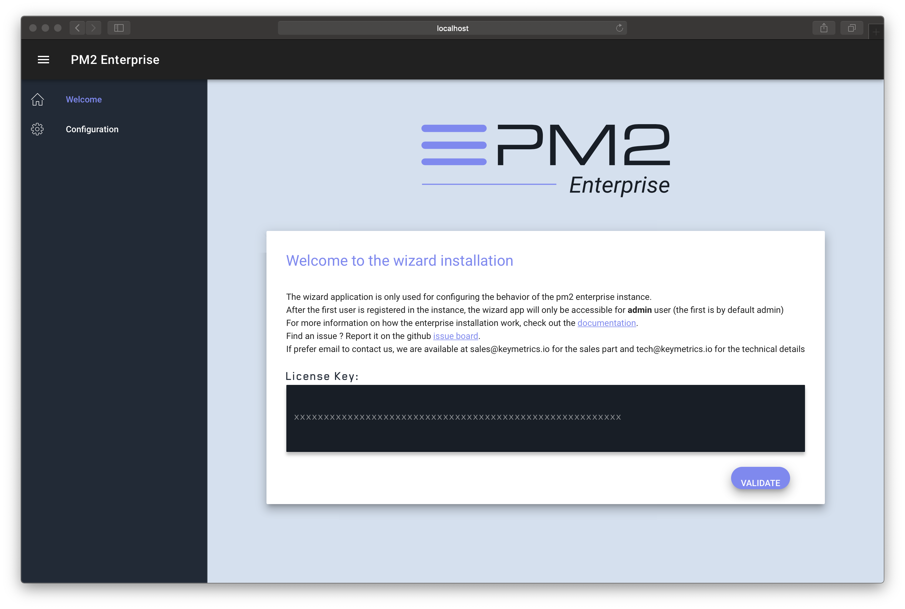

# PM2 EE Baremetal deployment

## Requirements

### Minimum recommended versions

- Docker: 17.12.0 (package: 1.5)
- Docker-compose: 1.8.0 (package: 1.8.0)

### Install Docker & Docker compose

```bash
sudo wget -qO- https://get.docker.com/ | sh
sudo curl -L https://github.com/docker/compose/releases/download/1.19.0/docker-compose-`uname -s`-`uname -m` -o /usr/local/bin/docker-compose
sudo chmod +x /usr/local/bin/docker-compose
```

Then make sure you have logged-in on the hub to be able to pull the private images:

```bash
docker login
```

## Steps to Install

### 1. Get the docker-compose.yml example file

```bash
wget https://raw.githubusercontent.com/keymetrics/on-premise/master/docker/docker-compose.yml
```

### 2. Start it

```bash
docker-compose up -d
```

Check the logs via:

```bash
docker-compose logs
```

| In the beginning some connections errors might appears but it's not critical (elasticsearch take few seconds to boot so the backend will restart for few seconds then connect when his ready)

### 3. Configure the instance

#### Minimal configuration

Connect to the wizard `yourinstanceaddress/wizard`, you should get this


paste your key and click on *Go to configuration*

You must add the *public address* as `yourinstanceaddress`. If you want to use a proxy in front of this instance (like Nginx), you have to configure the address here

NB: If your proxy use TLS, you must check the advanced configuration in *General/Websocket address* and use `wss` protocol instead of `ws`

#### Optional configuration

You can let users to signup to your instance, set *Allow standalone signup* to `true`

#### Infos

You can modify the configuration after the first install, but you must restart all the apps manually after your configuration validated

```bash
docker-compose restart
```

## Update Procedure

Just run docker-compose up again and it will pull the latest backend image:

```bash
docker-compose pull keymetrics/km-wizard-dedicated keymetrics/km-api-dedicated keymetrics/noex-enterprise
docker-compose restart
```

A downtime of around 30 seconds maximum will happen.
